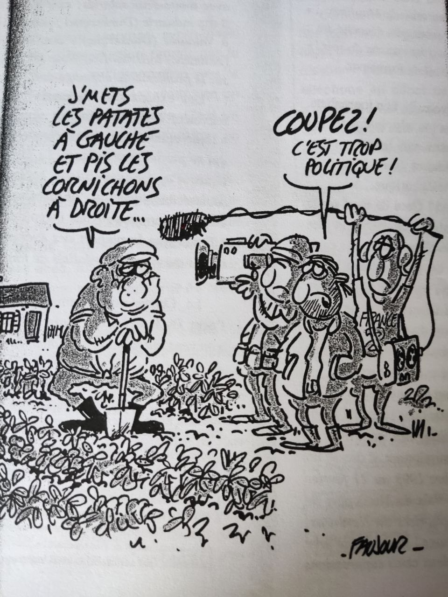

# *Les Petits Soldats du Journalisme* de Francois Ruffin 

Livre écrit par Francois Ruffin, journaliste et réalisateur francais, il nous présente comment est formée l'elite journalistique 
française en s'appuyant sur son propre passage au Centre de Formation des Journalistes. (CFJ)
Il détaille le métier de journaliste et son evolution.    

## Résume de l'extrait 

Dans cet extrait du livre *Les Petits Soldats du Journalisme*, Francois RUFFIN nous 
détaille comment le journalisme ce transforme de plus en plus en des breves actualités copiées 
sur l'AFP ainsi que des articles pour attirer un audimat. Le vrai journalisme n'existe presque plus, 
celui détaillant, critiquant et analysant les actualités pour les faire parvenir à un lectorat. Le
journalisme est désormais considère comme "médiateur" non plus comme sources d'informations.(AFP) 
**"Être le médiateur entre le public et les sources d'information de tout ordre: politiques,économiques, 
sociales, culturelles..."**
Les actualités deviennent de plus en plus des moyens de communications que se soit pour les 
marques ou pour l'État étant donné que les sources de revenues principales d'un journal viennent de 
ceux là (abonnements / meme si essor des abonnements en ligne). 
<a href="https://www.lemonde.fr/le-monde-et-vous/article/2021/01/26/les-revenus-du-monde-des-sources-diversifiees_6067680_6065879.html">Revenus Le Monde</a>

## Dessin 

Caricature de Faujour : dessinateur caricaturiste francais
Plus de liberte d'expression dans les medias, il decide de ce qu'ils vont publier. 
La politique est censure. Chaîne télé étatisé / privatise (France 2).
Decide des informations donc ils peuvent nous cacher beaucoup de choses. IDK 
"Intérêt immédiat" = informations futiles au lieu d'informations importantes.

</img>